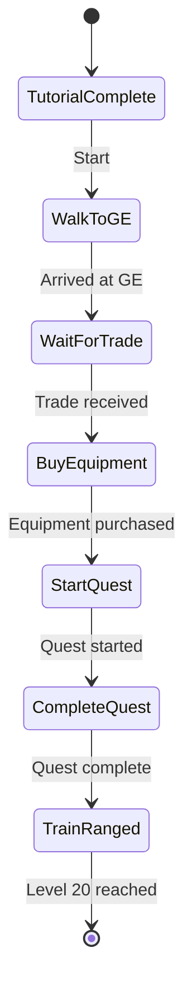

# Varlamore Ranged Plugin Implementation Plan

## 1. Directory Structure
```
runelite-client/src/main/java/net/runelite/client/plugins/microbot/varlamoreranged/
├── VarlamoreRangedConfig.java
├── VarlamoreRangedOverlay.java
├── VarlamoreRangedPlugin.java
└── VarlamoreRangedScript.java
```

## 2. File Descriptions

### VarlamoreRangedConfig.java
- Configuration interface
- Minimal implementation initially
```java
@ConfigGroup("varlamoreranged")
public interface VarlamoreRangedConfig extends Config {}
```

### VarlamoreRangedOverlay.java
- Status overlay showing current action
- Modified title: "Micro Varlamore Ranged"
- Inherits from ExampleOverlay

### VarlamoreRangedPlugin.java
- Plugin descriptor with name: "VarlamoreRanged"
- Manages script lifecycle
- Initializes and cleans up resources

### VarlamoreRangedScript.java
- Core automation logic
- Implements state machine for gameplay sequence
- Extends Script class

## 3. Workflow State Diagram


## 4. Implementation Steps

### 4.1 Walk to Grand Exchange
- Use `Rs2Walker` API for pathfinding
- Handle obstacles and doors
- Start point: Tutorial Island exit
- End point: Grand Exchange center

### 4.2 Trade Detection
- Implement trade watcher using game events
- Timeout: 5 minutes
- Minimum amount: 10K coins

### 4.3 Grand Exchange Purchases
- Items to buy:
  - Oak shortbow (item ID 843)
  - Bronze arrows (item ID 882) x 500
- Use `Rs2GrandExchange` API
- Budget: All received coins

### 4.4 Children of the Sun Quest
- Steps:
  1. Talk to quest starter NPC
  2. Complete agility course
  3. Solve light puzzle
  4. Defend shrine
- Use `Rs2Quest` API for tracking

### 4.5 Ranged Training
- Location: Varlamore chicken pen
- Equipment:
  - Equip oak shortbow
  - Equip bronze arrows
- Combat:
  - Attack chickens
  - Loot feathers periodically
- Stop condition: Ranged level 20

## 5. Risk Mitigation
- Stuck state detection:
  - Timeout per state: 10 minutes
  - Fallback to previous state
- Health management:
  - Eat food at <50% HP
  - Use emergency teleport at <10% HP
- Random events:
  - Handle genie, mysterious old man
  - Dismiss random events
- Logging:
  - Detailed state transitions
  - Error reporting